#CI-CD-Jenkins-Project

Project Overview

This project demonstrates a simple CI/CD pipeline using Jenkins and Docker.
The source code is stored in GitHub, and Jenkins is used to automatically fetch the code, build a Docker image, and run the application inside a container.

The pipeline starts when Jenkins pulls the latest code from GitHub. Jenkins then builds a Docker image from the project and runs the container automatically. The running application can be accessed through a web browser, and build logs can be monitored using Jenkins console output.

This project helps in understanding how CI/CD automation, containerization, and continuous deployment work together in a real DevOps workflow.

--------------------------------------------------
# ==step:1==

Go to Jenkins and click New Item. Enter the job name, e.g., my-project12. Select Freestyle project and click OK.

Integrate Jenkins with GitHub

First, copy your project code from GitHub.

Then, go to Jenkins and paste the GitHub repository URL into the Jenkins Git Repository section.If your repository’s default branch is main, enter main in the Branch section.If your repository’s default branch is master, enter master in the Branch section.

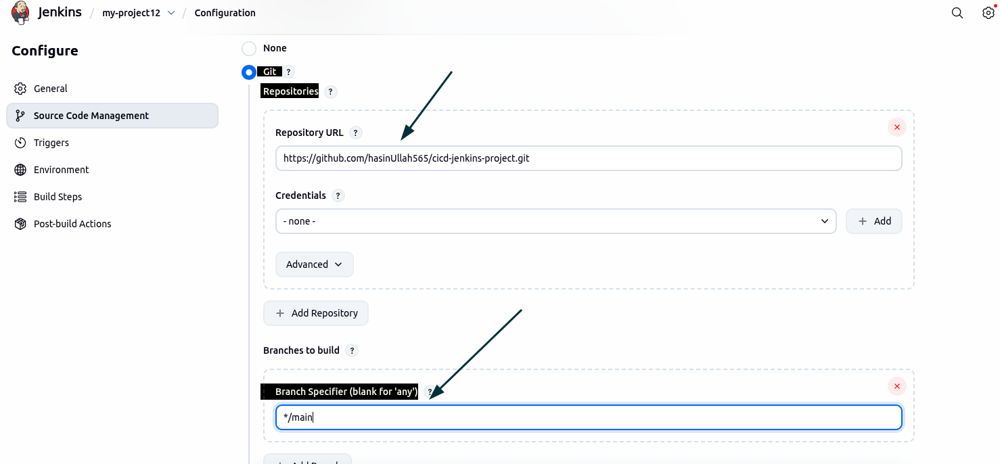

---------------------------------------

# ==Step:2==

Save and "Build" the Project
Click Save in Jenkins.
Go to the Build section and click "Build Now". 
The build will start, and you can monitor the progress in the Console Output.

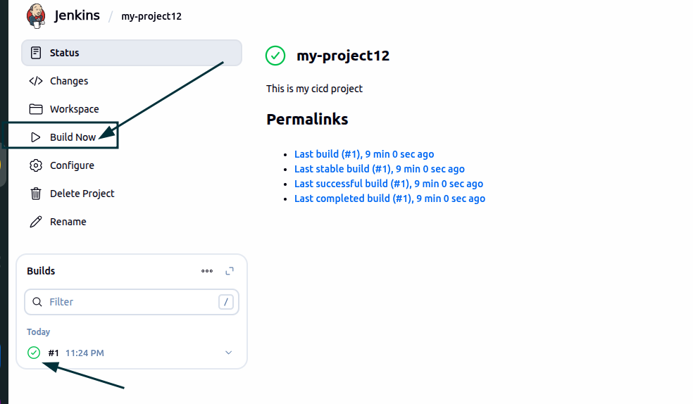

----------------------------------------

# Step 3: Check Your Jenkins Job Workspace

 ---> Open your terminal. Navigate to the Jenkins job workspace using: cd /var/lib/jenkins/workspace/
You will see the folder for the job you created (e.g., my-project12).

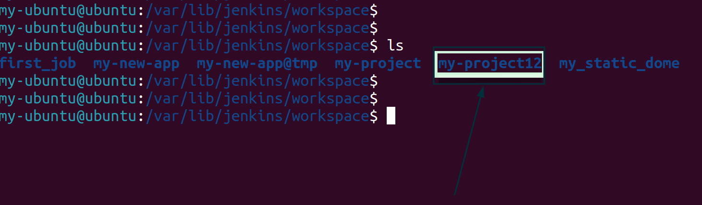

---------------------------------------

# Step 4: Create Docker Image for Your Project cd /var/lib/jenkins/workspace/my-project12

Build a Docker image for your project:

## docker build -t my-project12-image .

Verify that the image was created successfully:
docker images
You should see my-project12-image listed in the output.

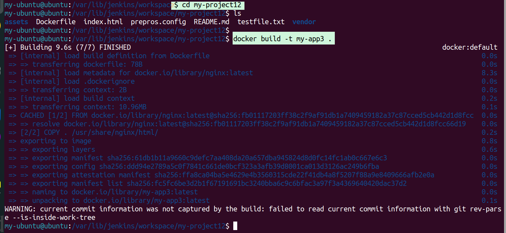

------------------------------------------

# Step 5: Run Docker Image and Verify in Browser

1.  Run the Docker container from your image:

`docker run -d -p 8001:80 my-app3:latest`

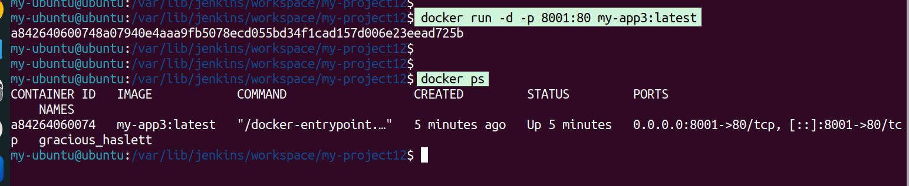

-----------------------------------------

docker ps

-d → runs container in detached mode

-p 8001:80 → maps container port 80 to local port 8001

Open your web browser and go to:

http://localhost:8001

--> docker stop <contanerid>
--> docker rm <containerid>
--> docker rmi <image_id>

-----------------------------------------

# Step 6:add jenkins user into docker group.

--> cat /etc/group | grep docker
--> sudo usermod -aG docker jenkins
--> sudo systemctl restart jenkins
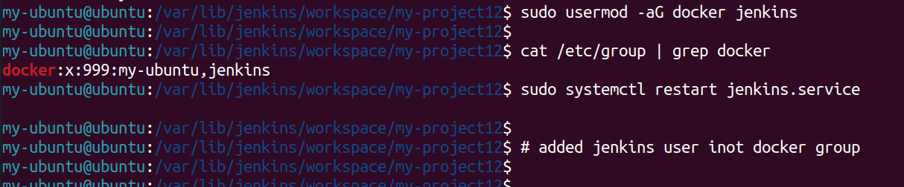

-----------------------------------------

# Step 7: Configure Build in Jenkins

1. Go to **Jenkins** and open your job configuration. Scroll down to the **Build** section.
    
2. Add **Execute shell** and write the following commands:
    

`docker build -t my-jen-image .`

`docker run -d -p 8005:80 --name my-jen-app my-jen-image:latest`

Save the configuration and run the build.

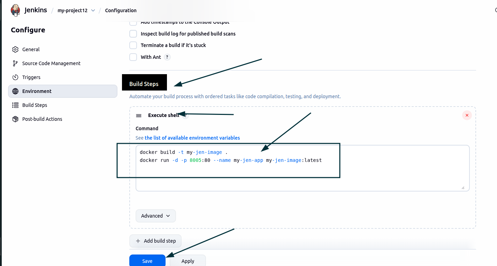

Then click Build Now and monitor the build process by checking the Console Output logs in Jenkins.

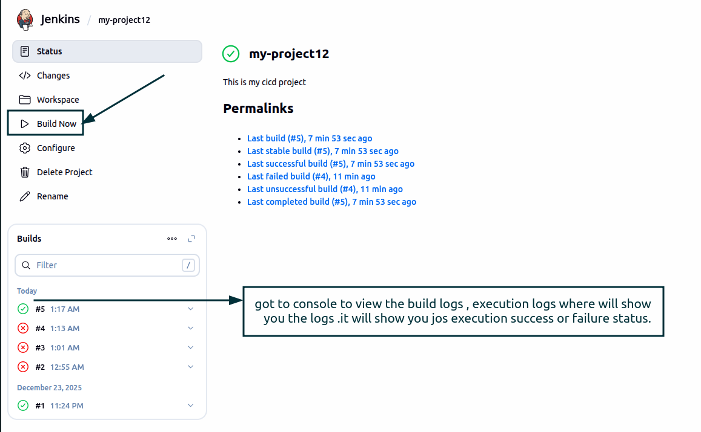

got to the browser and check the page are deployed or not 

`localhost:8005`

------------------------------------------

# step8:

Then go to the `terminal` and verify the Docker resources:
Run docker images to confirm that the image was built successfully.
Run docker ps to confirm that the Docker container is running.
This confirms that Jenkins successfully built the Docker image and ran the container

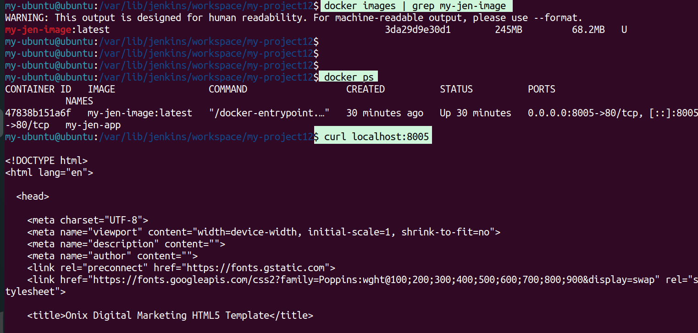

------------------------------------------
# step 9:
``docker stop my-jen-app``  –--> stops the running container

``docker rm my-jen-app``  –-> removes the container

``docker rmi my-jen-image``  –-> removes the old image

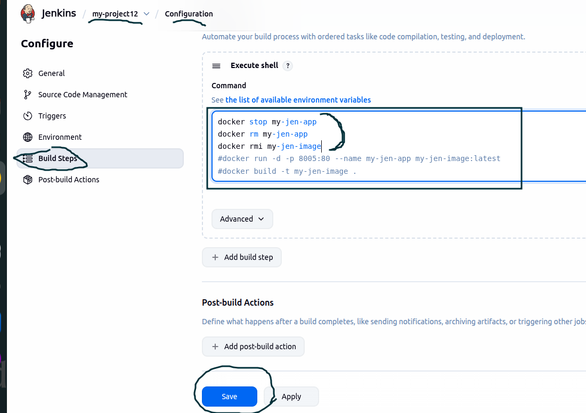

-------------------------------------------

# console output 

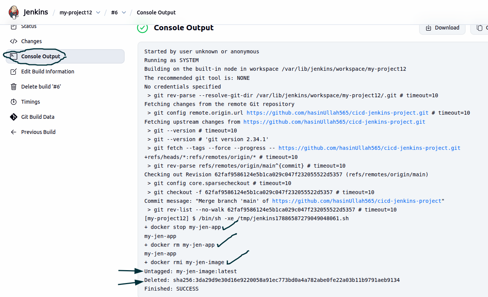

---------------------------------------------------

## Resume 
Built an automated CI/CD pipeline with Jenkins and Docker for containerized application deployment.
Integrated GitHub with Jenkins and automated build, run, and verification processes.

"======================================================="

CI/CD Pipeline with Jenkins and Docker
Project Overview

This project demonstrates a basic CI/CD pipeline using GitHub, Jenkins, and Docker. Jenkins automatically pulls the source code from GitHub, builds a Docker image, runs the container, and deploys the application.

Project Workflow

The developer pushes code to GitHub. Jenkins fetches the latest code, builds a Docker image, and runs the application inside a container. The build process and logs can be monitored through the Jenkins console output.

Jenkins Job Configuration

A Jenkins Freestyle project is created and connected to the GitHub repository. The correct branch is selected based on the repository configuration.

Build & Deployment

Jenkins builds the Docker image and runs the container automatically. Old containers and images are removed before each build to ensure a clean deployment.

Verification

The build progress and output can be checked in the Jenkins console. The running container confirms that the deployment was successful.

Learning Outcome

This project provides hands-on experience with CI/CD automation, Jenkins job configuration, and Docker-based deployment.

Author

Hassan (HasinUllah565)
DevOps Learner 🚀

